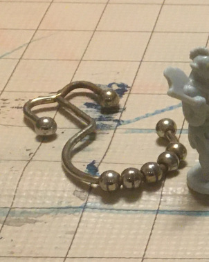

# Space Pirates

They've gathered at this abandoned mine to hideout. They have captured [[Bip]] without understanding his deal with the [[Plik]]s. They're merely happy to have taken 39 [[Wire]] from him. They don't know about his [[Vault]].

Space Pirate table:

1: Space Cyclops
2: Ninja
3-5: Thri-Kreen
6-8: Wirons

## Space Cyclops

Like [Pom Pom Monster](https://jimkang.com/weblog/articles/dnd-with-a-kid/pom-pom-dungeon/#pom-pom-monster) without Pom Poms.

The Space Cyclopses and Ninja are rivals for informal leadership of the Space Pirates.

[[Treasure table]] x 2d4+2
3d6 [[Wire]].
Red [[cardkey]].

## Ninja

[This guy again.](https://jimkang.com/weblog/articles/dnd-with-a-kid/pom-pom-dungeon/#ninja)

Now he has a [[Repulsor pack]] and 5 [[Stones]] and a [[Hand missile]] as well as 1d3 things from [[Treasure table]].
2d6 [[Wire]].
Red [[cardkey]]

## Thri-Kreen

https://www.dndwiki.io/monsters/thri-kreen

Names: Zorak, Raymond, Dvorak

hp 23, 26, 29

[[Treasure table]] A x 1d6
2d6 [[Wire]].

## Wirons

Attack: +5
HD: 4
AC: 17
STR: 17 (+5)

Grab: Opposed STR to break out
Chill wave: 1d8 in a 5' radius. Fortitude save for half.

hp 20, 12, 16, 19, 13

[[Treasure table]] A x 1d4
2d6 [[Wire]].

The Wirons are alien to Mottek. They hail from an icy planet and communicate only in writing to non-Wirons. They look sort of like metal curtain hooks. They conduct electricity and are stunned by it.