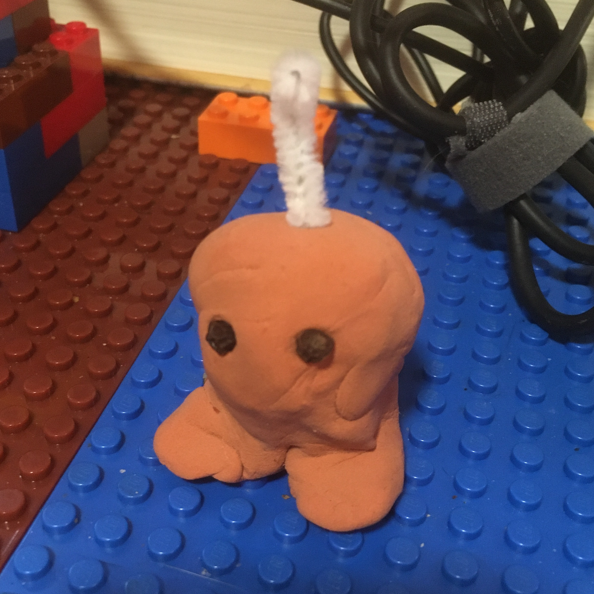

# Mottekians

Mottekians are the surface residents of Mottek.

They look like this.

They all have a [[Wire]] at the tops of their heads that they can use to receive and send [[Power]]. Receiving power heals them, and they can provide 1 Power per round, up to 5 Power.

You can make figurines of them with Play-doh or clay, using peppercorns (on any round thing) for eyes and pipe cleaner for the antenna.

They probably won't be more than two of them appearing at one time, so you can just make two, then swap out their antennae. (The color of their antennae is the only thing that distinguishes them from one another.)