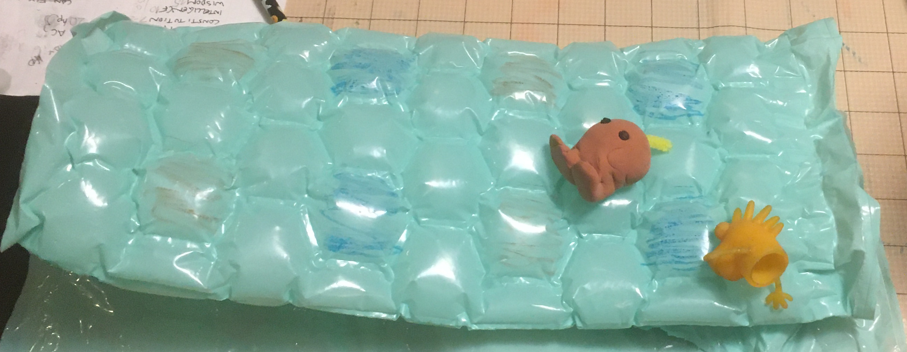

# Hex Puff Field

- Green hexes will teleport you to a random hex. (Roll d30 or d20+d10, then count that many spaces, going left to right and wrapping to the next row when the end of a row is reached.)
- Blue hexes will teleport you to a random location within the mine.
- Red hexes will teleport you outside.