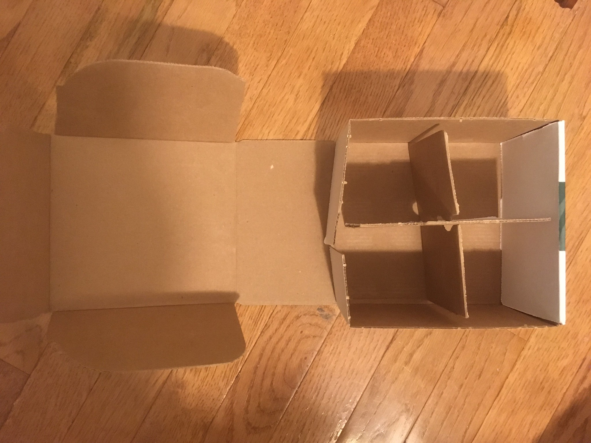

# Turnstile

The turnstile has a port that a wire could be connected to. Feeding 1 [[Power]] into it will turn it clockwise once each round, starting one round after it's connected. There's warning beeps.

1 in 3 chance of 1d4 [[Space Pirates]].