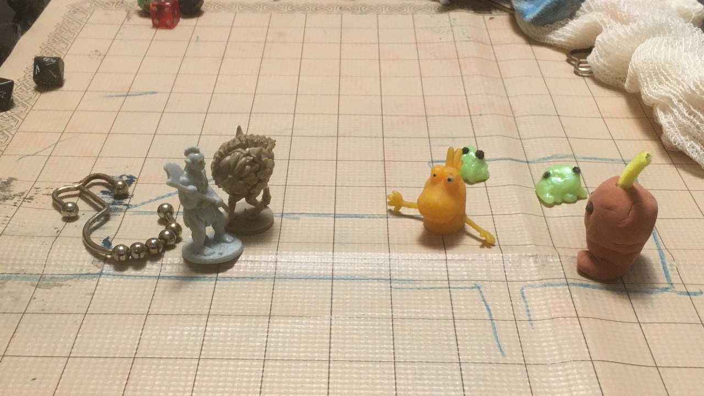

# What is Orm Mines for

This was designed as a solo adventure for a player, age 7, with a 4th level character. It's part of the campaign started with [Pom Pom Dungeon](https://jimkang.com/weblog/articles/dnd-with-a-kid/pom-pom-dungeon/). It was written in a few hours and playtested exactly once.

The player requested an adventure that took place on another planet, so the adventure is set on a planet called Mottek, and has sci-fi tropes like [[Repulsor pack]]s and devices powered by energy sources.

We play 5E D&D, but this is fairly stat-light, so I imagine you could fit it to a lot of systems or just pick out anything you like and put it in your own adventure.

# Start

[[Oomoo]], the Mayor's friend from Mottek got a message from her planet about [[Dungeon map]] It is no longer producing [[Bubbubbub]], which the [[Mottekian]]s need to make their [[Mottekian spossip]]s.

She needs a hero to go to Mottek to find out why. She offers 10 units of [[Wire]] to get them started.

She will drop the PC off at [[Orm Outpost]].

# Running the game

The main quest is helping the [[Mottekian]]s find out what happened to the [[Bubbubbub]]. Along the way there are [[Space Pirates]] to avoid, trick, or fight.

The reason the [[Bubbubbub]] is gone lies with [[Bip]], and the cause may not be what a younger player expects. There are many ways they could resolve this, and you, the DM, should be flexible about it. (Any time you want to push things toward a conclusion, you can have Bip show up.)

## Map

The map is at [[Dungeon map]].

## Props

This is a very prop-heavy adventure. Many locations and characters will have a picture of a prop to represent it.

You can either:

- Find something like it lying around and use that
- Just don't use the prop and do traditional D&D Theater of the Mind if they player is cool with that.

## Grabbing things from opponents

The PC can grab an item out of someone's hands by making a successful opposed DEX check, then (unless the target is not expecting it) making a successful opposed STR check. Sometimes, this makes up the bulk of combat.

## Random tables

There's a few random tables in this adventure, but as in any adventure, you don't have to roll. If you see a choice that's more interesting than the others in the moment, you can just pick that.

Even if the PC is being pursued by or is pursuing a chararcter, it may still be worth rolling to see if they run into yet another thing. Chases ending in multi-party encounters are maybe the funnest part of this adventure.

## Death

There is a strong possibility of the PC facing many opponents close to them in level. In these situations, the player can trick their way around it (be generous when they try something unconventional) or run or hide. If they don't, however, they are likely to hit 0 hp.

When the character reaches 0 hp, they are knocked out, and wake up in either the [[Prison Coil]] or, if the player has been having a particularly hard time, at [[Orm Outpost]]. They will be stripped of all of their equipment, except maybe something small, like a green [[cardkey]].

They're free to get knocked out as many times as they want and try again as many times as they want.

If the player can handle character death without it being upsetting, you can just have them die, then roll up a new character.